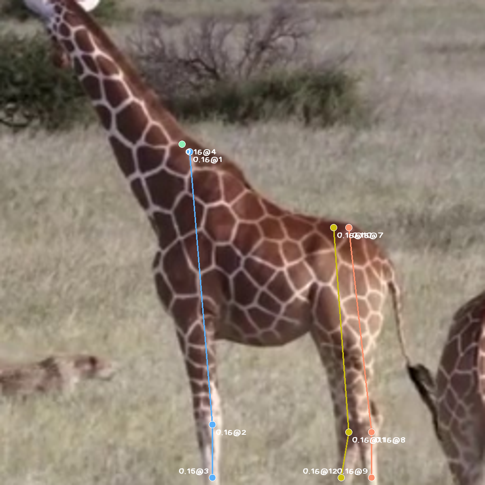
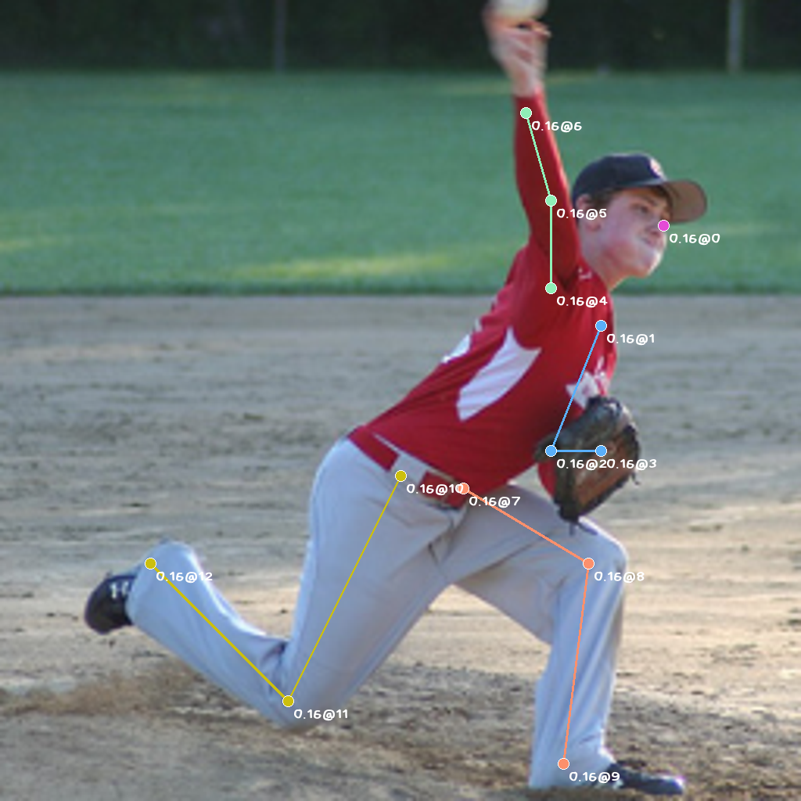

# Unipose<a href="https://github.com/Gennadiyev/unipose"></img></a>

[](https://gennadiyev.github.io/unipose/apidocs) [](https://black.vercel.app/) [](https://www.python.org/downloads/) [](https://mit-license.org/) 

**Bridging the poses of humans and tetrapods with one general model.**

<!-- ## Capabilities

- **Pose estimation**: Unipose can estimate the pose of any tetrapod with high accuracy.
- **Pose tracking**: Unipose can track the pose of any tetrapod in a video sequence. (TODO)
- **Animal Classification**: Unipose can classify the species of any tetrapod based on its pose. (TODO) -->

<!--   -->

</img> </img>

## Features

- **Generalized model**: Unipose is a generalized model that can be applied to any tetrapod species.
- **Joint datasets made easy**: Unified datasets for humans and animals are hard to come by. We provide a unified dataset base class for humans and animals as well as literally anything.
- **Code quality**: Unipose utilizes a modern python development toolchain using [poetry](https://python-poetry.org/) for packaging, [black](https://black.vercel.app/) for code style enforcement, [pytest](https://pytest.org/) for automated testing and [pydoctor](https://pydoctor.readthedocs.io/en/latest/) for documentation.

## Installation

### Prerequisites

**Python 3.10** is required since we are using `typing.TypeAlias` and `typing.Protocol` in the codebase.

<!-- **Python 3.9** or later is required since we will use [dataclasses](https://docs.python.org/3/library/dataclasses.html) in the future and we heavily rely on [type hints](https://docs.python.org/3/library/typing.html) as updated in [PEP 585](https://www.python.org/dev/peps/pep-0585/) and [PEP 586](https://peps.python.org/pep-0586/) (`Literal` type). -->

During development, we use PyTorch 1.13.0 and torchvision 0.14.0.

### Install with conda

Or if you use [conda](https://docs.conda.io/en/latest/):

```bash
git clone git@github.com:Gennadiyev/unipose.git
cd unipose
conda env create -f environment.yaml -n unipose
conda activate unipose
```

### Install with pip

The package is currently not published to PyPI. To install, clone the repository and run `pip install -e .` in the root directory:

```bash
git clone git@github.com:Gennadiyev/unipose.git
cd unipose
pip install -e .
```

### Install with poetry

Or if you use [poetry](https://python-poetry.org/):

```bash
git clone git@github.com:Gennadiyev/unipose.git
cd unipose
poetry add -D .
```

## Usage

### Download pretrained models

Our models are not that heavy (~169 MB each). Fetch one from [this Google Drive link](https://drive.google.com/drive/folders/1eJ9RyLHcezrxE02uHBNmrI0Wxg4OPkfQ). We suggest putting them under `$UNIPOSE_ROOT/models`.

| Model | Specialty |
| --- | --- |
| [`model_run-5dd8_ep-60.pth`](https://drive.google.com/file/d/12NJ5EFBeyQdf-dtMDrV5Kg82Gq9vUl7L/view) | For humans and tetrapods. Known to perform poorly if the pose is partially occluded or looks strange. |
| [`model_run-cd37_ep-100.pth`](https://drive.google.com/file/d/1f3uAjAzKh5O4Gh6vNuDZ99e78JlhoBnT/view) | For humans and tetrapods. More stable than `model_run-5dd8_ep-60.pth` but not as accurate in confidence value. |

### Visualize skeleton with script

You can also visualize the results with a featureful visualization script `scripts/visualize.py`.

Example with `model_run-5dd8_ep-60.pth`, using an image sampled from COCO dataset:

```bash
python scripts/visualize.py \
    --dataset coco \
    --dataset_path datasets/coco \
    --checkpoint models/model_run-5dd8_ep-60.pth
```

Example using the same checkpoint with your own image:

```bash
python scripts/visualize.py \
    --checkpoint models/model_run-5dd8_ep-60.pth \
    --image_path test_images/your_own_image.jpeg
```

Use `python3 scripts/visualize.py --help` to see the full usage. 

> *Hidden feature!* The `image_path` also supports a directory path. The script will visualize all images in the directory, and output a GIF animation! Files under the directory must follow the naming scheme `*-{id}.*` or `*_{id}.*` (more specifically in regex, `^.+[-_]\d+\..+$`), or the output GIF may have unsorted frames.

### *(Beta)* Run a flask server for testing

Our test server is out! It is a flask server that can be used to test the models. Especially useful during training since it scans all models under the model directory and let users pick any model they want. **Not optimized for multi-user case**, if more than 1 user is perfoming inference, the server will queue them (expectedly).

1. Edit the `server/config.json` file to change the font path, port and model path. Usually the directory containing of the experiment output path as specified in `output_dir` parameter during a [train run](#start-training).

2. Run `python3 server/server.py server/config.json`.

Note: **Do not change the naming scheme of the model file.** The server will automatically detect the model epoch and run ID.

## Training

### Prepare datasets

Most datasets we use have COCO-style annotations. We use the `unipose.cocotools` module to load the annotations.

#### COCO

```bash
coco
├── annotations/
│   ├── captions_train2017.json
│   ├── captions_val2017.json
│   ├── instances_train2017.json
│   ├── instances_val2017.json
│   ├── person_keypoints_train2017.json
│   └── person_keypoints_val2017.json
├── train2017/
│   ├── 000000000009.jpg
│   └── ...
└── val2017/
    ├── 000000000139.jpg
    └── ...
```

(More datasets are coming soon.)

### Start training

Our model is configuration-free and is trained with a single command:

```bash
python scripts/train.py --coco --output_dir exp
```

The log, model checkpoints, optimizer states will be saved to the `exp` directory. Use `python3 scripts/train.py --help` to see the full usage.

> Since more than one dataset can be selected for one training session, the `--coco` flag can be used together with other dataset flags. See `scripts/train.py` for more details.

> Currrently multi-GPU training is not supported. We are working on it.

## Active maintainers

- [Yikun Ji (Kunologist)](https://github.com/Gennadiyev)
- [Qi Fan (fanqiNO1)](https://github.com/fanqiNO1)

## Contributing

Contributions are welcome! Please see [CONTRIBUTING.md](CONTRIBUTING.md) for more information.

There will be follow-up papers and code for a similar purpose. Stay tuned!

## FAQ

### Conda cannot create environment from `environment.yaml`

The developers use a few local mirrors to speed up conda package downloading. If you are not using the mirrors, you can remove the mirror URLs from the `channels` section in `environment.yaml` and use the default channels. Do not remove the `conda-forge` channel since it is required for `pytorch` and `torchvision`.

### Dataset issues

In the latest version of Unipose, we added `unipose.cocotools` as an adapted version of `pycocotools` that supports our use case. However, the original `pycocotools` is still required. Please update to the latest version of Unipose if you are using an older version.

### Since it has the same name, is this project affiliated with that UniPose?

We prefer to be styled as `Unipose` instead of `UniPose`. Despite the similar name as [bmartacho/UniPose](https://github.com/bmartacho/UniPose), we are not affiliated in any way.
